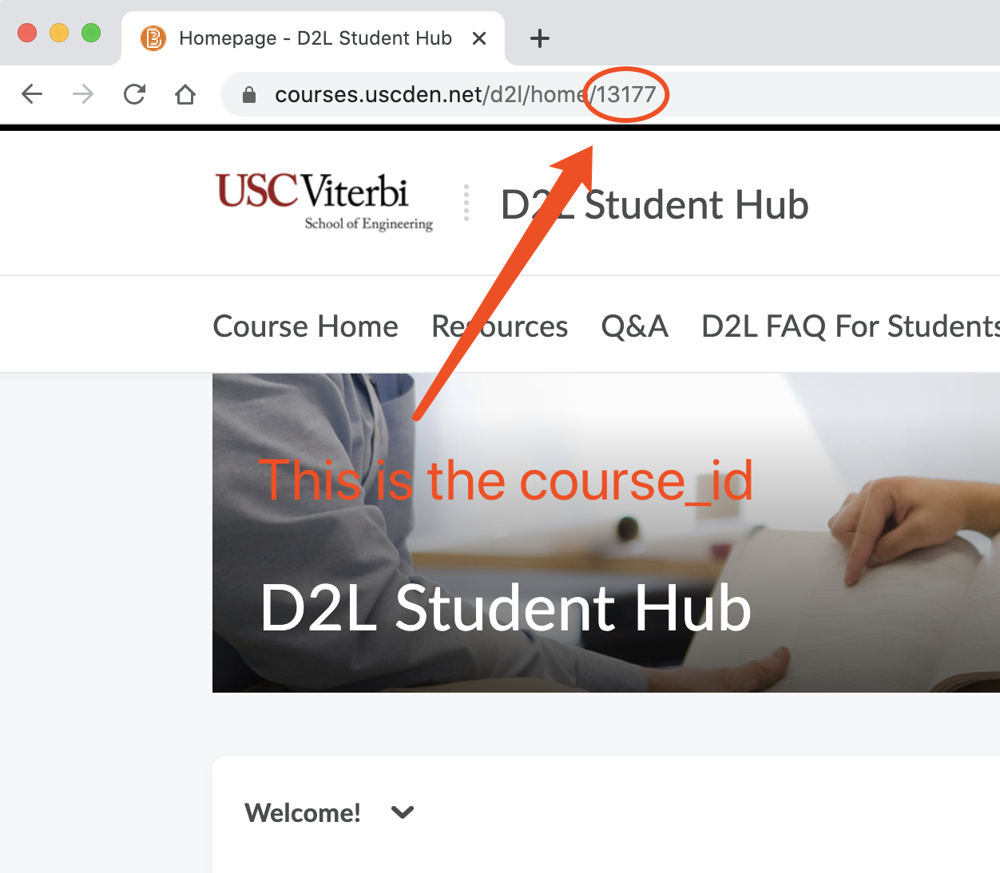

# USC DEN 视频下载小工具

## 依赖的包和软件
- `Python 3`
- `ffmpeg` (mac下建议用homebrew安装)
- Python三方包: `requests` (通过pip或者conda安装)
- Python三方包: `selenium` (开发用的3.141.0版本，通过pip或者conda安装)
- `selenium`使用的浏览器驱动
#### 关于selenium浏览器驱动
开发用的Chrome驱动，[下载地址](https://sites.google.com/a/chromium.org/chromedriver/)
    - win: 将解压后的文件放入配置了环境变量的文件夹, 如python的文件夹.
    - mac/linux: 将解压后的文件移动到`/usr/loacl/bin`目录中.

## 使用方法
可以采用`Run All`或`Run by Steps`。
#### Run All
1. 在项目根文件夹中新建`config.json`并录入以下信息:
    - 登录DEN的`username`
    - 登录DEN的`password`
    - 要下载视频的网页的`URL`
2. 执行`./run.sh`
#### Run by Steps:
1. 在项目根文件夹中新建`config.json`并录入以下信息:
    - 登录DEN的`username`
    - 登录DEN的`password`
    - 要下载视频的网页的`URL`
2. 执行`python parser.py`获得视频解析之后的链接`urlOfVideos.json`。
3. 执行`python downloader.py`下载视频

#### 关于config.json
`config.json`示例：
```json
{
    "username": "abc@usc.edu",
    "password": "abcdefg",
    "urls": [
        "https://courses.uscden.net/d2l/le/content/16098/viewContent/275571/View",
        "https://courses.uscden.net/d2l/le/content/16098/viewContent/275938/View",
        "https://courses.uscden.net/d2l/le/content/16098/viewContent/276273/View",
        "https://courses.uscden.net/d2l/le/content/16098/viewContent/276574/View",
        "https://courses.uscden.net/d2l/le/content/16098/viewContent/277068/View",
        "https://courses.uscden.net/d2l/le/content/16098/viewContent/277334/View"
    ]
}
```
`URL`图示:
